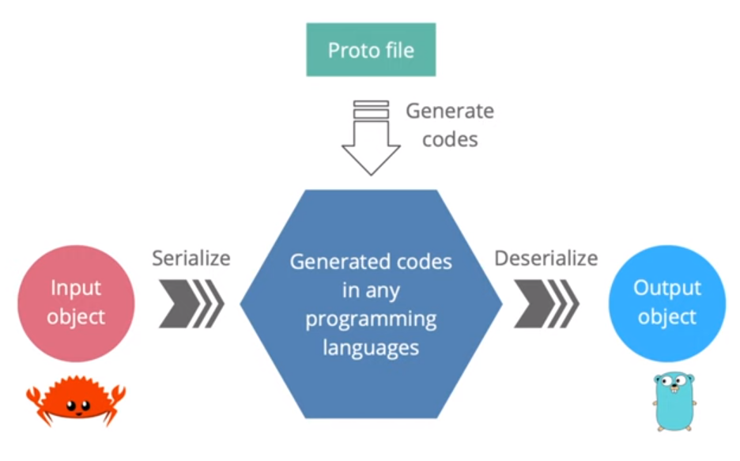

## The complete gRPC course
Youtube playlist: [Link to the course](https://www.youtube.com/watch?v=O8Yu7JwkFLM&list=PLy_6D98if3UJd5hxWNfAqKMr15HZqFnqf&index=3)

### The motivation of gRPC
**Communication between different languages**
- BE and FE are written in different languages
- Micro-services might be written in different languages
- They must agree on the API contracts to exchange information
- Communication channel: REST, SOAP, message queue
  - Authentication mechanism: Basic OAuth, JWT
  - Payload format: JSON, XML, binary
  - Data model
  - Error handling

**Communication should be efficient**
- Huge amount of exchange messages between micro-services
- Mobile network can be slow with limited bandwidth

**Communication should be simple**
- Client and server should focus on their core service logic
- Let the framework handle the rest

### What is the gRPC
- gRPC is a high-performance open-source feature-rich RPC framework
- gRPC is originally developed by Google
- Now it's part of the Cloud Native Computing Foundation - CNCF
- **g** stands for different things in each gRPC release: gRPC, good, green, glorious, game, gon, ...
- RPC stands for Remote Procedure Calls

### What is Remote Procedure Calls?
- It's a protocol that allows a program to
  - execute a procedure of another program located in other computer
  - without the developer explicitly coding the details for the remote interaction
- In the client code, it looks like we're just calling a function of the server code directly
- The client and server codes can be written in different languages

### How gRPC works?
- Client has a generated stub that provides the same methods as the server
- The stub calls gRPC framework under the hood to exchange information

### How stubs are generated?
- API contracts description
  - The services and payload messages are defined using Protocol Buffer
- Server and clients stubs are generated by the
  - Protocol Buffer compiler
  - gRPC plugins of each language

### Why gRPC uses Protocol Buffer
- Human-readable Interface Definition Language (IDL)
- Programming languages interoperable
  - Code generators for many languages
- Binary data representation
  - Smaller size
  - Faster to transport
  - More efficient to serialize / deserialize
- Strongly typed contract
- Conventions for API evolution
  - Backward & forward compatibility
- Alternative options
  - Google flatbuffers
  - Microsoft bond

### What languages are supported by gRPC?
- 10 officially supported languages
  - Pure implementation: Go, Java, NodeJS
  - Wrap C-gRPC core: C/C++, C#, Objective-C, Python, Ruby, Dart, PHP
- Many other unofficial libraries: Swift, Rust, TypeScript, Haskell, etc.

### What makes gRPC efficient?
**gRPC uses HTTP/2 as its transfer protocol**
- Binary framing
  - More performant and robust
  - Lighter to transport, safer to decode
  - Great combination with Protocol Buffer
- Header compression using HPACK
  - Reduce overhead and improve performance
- Multiplexing
  - Send multiple requests and responses in parallel over a single TCP connection
  - Reduce latency and improve network utilization
- Server push
  - One client request, multiple responses
  - Reduce round-trip latency

### How HTTP/2 works under the hood
- Single TCP connection carries multiple bidirectional streams
- Each stream has a unique ID and caries multiple bidirectional messages
- Each message (request/response) is broken down into multiple binary frames
- Frame is the smallest unit that carries different types of data: HEADERS, SETTINGS, PRIORITY, DATA, etc.
- Frames from different streams are interleaved and the reassembled on the other side

**The new binary framing layer in HTTP/2 enables stream multiplexing**

### HTTP/2 vs HTTP/1.1
| Test | HTTP/2 | HTTP/1.1 |
| ---- | ---- | ---- |
| Transfer Protocol | Binary | Text |
| Headers | Compressed | Plain text |
| Multiplexing | Yes | No |
| Requests per Connections | Multiple | 1 |
| Server Push | Yes | No |
| Release Date | 2015 | 1997 |

### 4 types of gRPC

| Name                    | Description                                                                       |                                                            | Example Proto                                                                                                                                                                                                                                       | Use Case                                                                          |
|-------------------------|-----------------------------------------------------------------------------------|------------------------------------------------------------|-----------------------------------------------------------------------------------------------------------------------------------------------------------------------------------------------------------------------------------------------------|-----------------------------------------------------------------------------------|
| Unary                   | Client sends a single request to he server and waits for a single response        |                    | <pre lang="proto">
service MyService {   rpc GetResource (ResourceRequest) returns (ResourceResponse); }
message ResourceRequest {   string resource_id = 1; }
message ResourceResponse {   string data = 1; }</pre>        | Simple request-response operations                                                |
| Client Streaming        | Client sends a single request to the server and receives a stream of responses    |         | <pre lang="proto">
service FileUploadService {   rpc UploadFile (stream FileRequest) returns (FileResponse); }
message FileRequest {   bytes data_chunk = 1; }
message FileResponse {   string status = 1; }</pre>          | Realtime updates suck as stock market data or chat messages                       |
| Server Streaming        | Clients sends a stream of requests to the server and receives a single response   |         | <pre lang="proto">
service ChatService {   rpc StreamMessages (MessageRequest) returns (stream MessageResponse); }
message MessageRequest {   string user_id = 1; }
message MessageResponse {   string message = 1; }</pre> | Uploading large files or aggregating data from multiple resources                 |
| Bidirectional Streaming | Both client and server can send a stream of messages to each other simultaneously |  | <pre lang="proto">
service ChatService {   rpc Chat (stream ChatRequest) returns (stream ChatResponse); }
message ChatRequest {   string message = 1; }
message ChatResponse {   string reply = 1; }</pre>                  | Interactive applications where both client & server need to send data in realtime |

### gRPC vs REST
| Feature | gRPC | REST |
| --- | --- | --- |
| Protocol | HTTP/2 (fast) | HTTP/1.1 (slow) |
| Payload | Protobuf (binary, small) | JSON (text, large) |
| API contract | Strict, required (.proto) | Loose, optional (OpenAPI) |
| Code generation | Built-in (protoc) | 3rd-party tools (Swagger) |
| Security | TLS/SSL | TLS/SSL |
| Streaming | Bidirectional streaming | Client -> Server request only |
| Browser support | Limited (require gRPC-web) | Yes |

### Where gRPC is well suited for?
- Microservices
  - Low latency and high throughput communication
  - Strong API contract
- Polyglot environments
  - Code generation out of the box for many languages
- Point-to-point realtime communication
  - Excellent support for bidirectional streaming
- Network constrained environments
  - Lightweight message format

## Secure gRPC connection with SSL/TLS
3 types of gRPC connections
- Insecure
  - Plain text data. No encryption. Don't use it for production
- Server-side TLS
  - Encrypted data. Only server needs to provide its certificate to client
- Mutual TLS
  - Encrypted data. Both server and client need to provide certificates to each others

## Load balancing gRPC services with NGINX
- Install nginx on your local machine
- update nginx/nginx.conf by using our customize nginx.conf
- Copy all files (with certificate files) under /nginx to /usr/local/etc/nginx/
- Run 2 servers: 8089, 8090 that proxy by 8080 port from nginx for load balancing
- Client should connect to nginx 8080 port instead of individual server