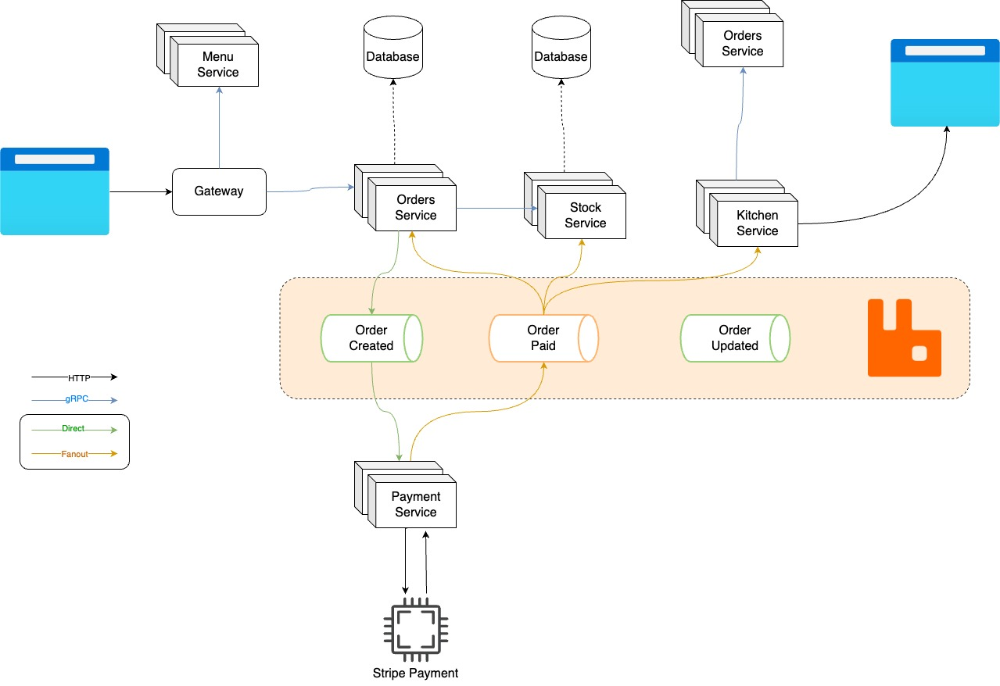

# Order Management System - Microservices

## Tech Stack
```
1. Go 1.22+
2. Golang cosmtrek/air for hot-reloading
3. gRPC for communmication between services
4. RabbitMQ as message broker
5. Docker with Docker Compose
6. MongoDB as storage layer
7. Jaeger for service tracing
8. HashiCorp's Consul for service discovery
9. Stripe for payments
```

## Architectures


```
Orders Service
  -, Validate order details -> Talk with stock service
  -, CRUD of Orders
  -, Initiates the Payment Flow -> by sending an event

Stock Service
  -, Handles stock
  -, Validate order quantities
  -, Might return items as menu

Menu Service
  -, Stores items as menu

Payment Service
  -, Initiates a payment with a 3rd party provider (Stripe)
  -, Produces an order Paid/Cancelled event to orders/stock/kitchen

Kitchen Service
  -, Long running process of a "Simulated kitchen staff"
```