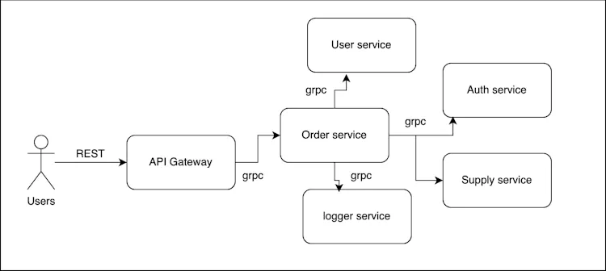

## Simple Go GRPC API Gateway
Reference: https://www.koyeb.com/tutorials/build-a-grpc-api-using-go-and-grpc-gateway

### API Gateway


### Install Protobuf Compiler
```shell
apt install -y protobuf-compiler
protoc --version  # Ensure compiler version is 3+
```

### Init go project
```shell
go mod init github.com/hwebz/simple-go-grpc-gateway
```

### Download Google date.proto
```shell
curl -L https://raw.githubusercontent.com/googleapis/googleapis/master/google/type/date.proto -o proto/google/api/date.proto
```

### Install protoc-gen-go
```shell
cd ..
go install google.golang.org/protobuf/cmd/protoc-gen-go
```

### Generate proto files
```shell
make protoc
```

### Install some missing dependencies for generated code
```shell
go get google.golang.org/protobuf # Go implementation for protocol buffers
go get google.golang.org/genproto # Contains the generated Go packages for common protocol buffer types
go get google.golang.org/grpc # for grpc generated codes
```

### Run main application
```shell
make run
```

### Service definition compiler
```shell
go install google.golang.org/grpc/cmd/protoc-gen-go-grpc@latest
```